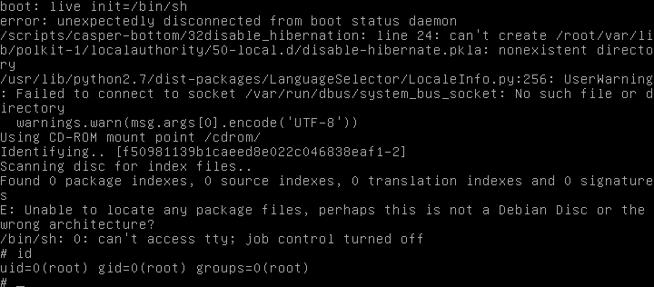

# Boot in Root

After some research, we realize that one of the easiest ways to become is to go through **grub** to put us in a **"Recovery "** mode.

However we don't have grub.

It turns out that ISO has **syslinux**.

We are looking for the syslinux config file (**isolinux.cfg**), so :
<pre><code>> find / -type f -name isolinux.cfg -print 2>/dev/null
/cdrom/isolinux/isolinux.cfg
> cat /cdrom/isolinux/isolinux.cfg
default live
prompt 0
timeout 0

menu title BornToSec
menu background splash.png
menu color title 1;37;44 #c0ffffff #00000000 std

label live
  menu label live - boot the Live System
  kernel /casper/vmlinuz
  append  file=/cdrom/preseed/custom.seed boot=casper initrd=/casper/initrd.gz quiet splash --
</code></pre>

So we know that for booting, our ISO uses the *label* **live**.

We restart our VM by holding down the [Shift] or [Alt] key to dodge the default launch (defined by **isolinux.cfg**).

Once in the "**Recovery**" terminal we type the following command :
<pre><code>live init=/bin/sh</code></pre>
> We use the live label to boot normally and add the command <code>init=/bin/sh</code>, which will force the kernel to run /bin/sh instead of its default init.

